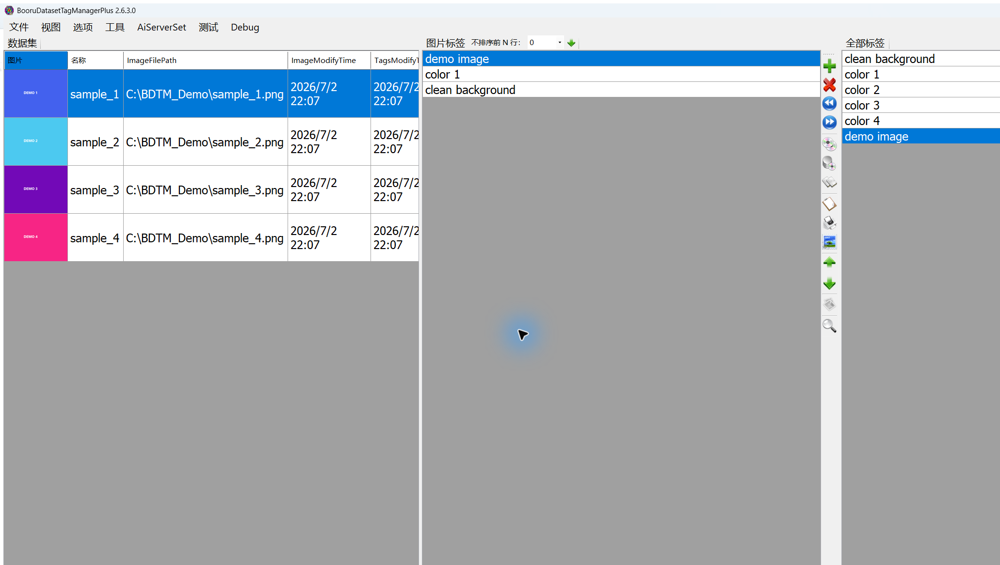
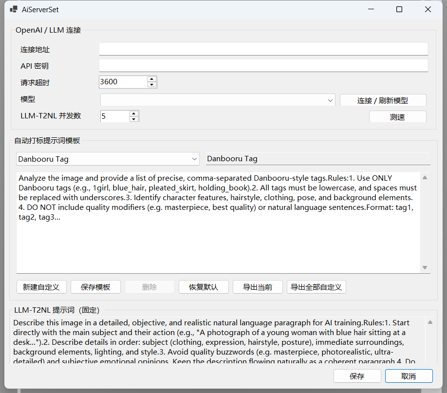
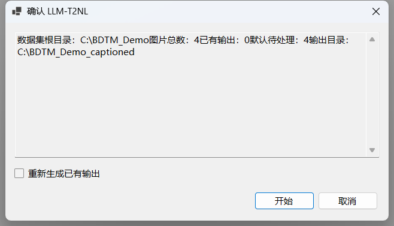

# BooruDatasetTagManager+

[简体中文](README_zh_CN.md)

BooruDatasetTagManager+ is a Windows desktop application for reviewing, searching, translating, and generating tags for image datasets. It is based on the original BooruDatasetTagManager and extends its workflow with an OpenAI-compatible auto-tagging path, native C# caption generation, stronger batch controls, and additional Chinese-language tooling.


## Project Positioning and Upstream

The Plus edition keeps the original WinForms dataset editor at its center: open a dataset folder, inspect an image, edit its same-name `.txt` file, and move through the collection. Source images are treated as read-only data throughout browsing and annotation; the feature scope is dataset preparation rather than image generation.

This repository is a community fork. Please consult the upstream project and this repository's license before redistributing modified builds.

## Differences from the Original

| Area | Original workflow | Plus workflow |
| --- | --- | --- |
| Auto-tagging | Local interrogator-oriented setup | One OpenAI-compatible connection and selectable prompt templates |
| Prompt management | Fixed task prompts | Four built-in templates plus editable, exportable custom templates |
| Caption conversion | External script or manual workflow | Native C# LLM-T2NL batch processing |
| Caption output | Generated caption only | Original tag text, one newline, then the natural-language caption |
| Batch safety | Tool-dependent | Sibling `_captioned` output, atomic text replacement, cancel support, per-file error isolation |
| Throughput | Sequential caption workflow | Configurable LLM-T2NL concurrency from 1 to 100 (default 5) |
| Chinese datasets | Basic tag editing | Chinese alias lookup, translation fallback, and bundled Danbooru tag data |
| Reference tools | Local editing | Integrated Danbooru Wiki lookup and improved quick-replace/test dialogs |
| Crop/background tools | Local AiApiServer | Still supported through the dedicated local AiApiServer path |

## Main Dataset Workflow

1. Open a dataset directory. Images may be in nested folders; same-name `.txt` files are treated as tags.
2. Select an image and edit, search, translate, add, remove, or reorder its tags.
3. Save changes before switching datasets or starting a batch operation.
4. Use the toolbar or menus for auto-tagging, Wiki lookup, quick replacement, crop, and background removal.
5. Use **Tools → LLM-T2NL** when natural-language training captions are needed for the entire loaded dataset.



## AiServerSet

AiServerSet is the single configuration window for OpenAI-compatible features. Enter an HTTP or HTTPS API base address (commonly ending in `/v1`), an API key if required, a timeout, and a model. **Connect / Refresh models** queries the currently entered endpoint; **Speed test** sends one short text request and measures model-response time without saving the draft configuration.

Fresh builds ship with the endpoint, key, model, system prompt, and user prompt empty. Endpoints are used exactly as entered, without address inference or automatic rewriting. HTML responses, invalid JSON, authentication failures, timeouts, and network errors are classified separately, while a failed refresh preserves the existing model configuration.

LLM-T2NL concurrency is configured here as an integer from 1 to 100. It affects only LLM-T2NL; auto-tag previews and the speed test remain single requests.



## Auto-Tagging Prompt Templates

Single-image, selected-image, and full-dataset auto-tagging all use the template selected in AiServerSet. Four built-in templates are available by default: Danbooru Tag, Natural Language, Mixed Mode, and Natural Language 2.

Built-in templates support content edits and restoration while their identifiers and names remain fixed. Custom templates can be created, renamed, edited, saved, and deleted. Names and content must be non-empty, and names are unique without regard to letter case. **Export current** writes the selected template; **Export all custom** writes only custom templates. The versioned export schema is limited to template metadata and content; connection settings and credentials are outside its data model.

## Native LLM-T2NL

LLM-T2NL converts the complete currently loaded dataset into natural-language captions using the configured OpenAI-compatible vision model. It always uses its dedicated natural-language task prompt, independent of the auto-tagging template selection.

Before starting, the application offers to save pending tag edits and shows a scan summary. Existing output is skipped by default; enable **Regenerate existing output** to atomically replace generated text. Processing supports cancellation; per-file failures are isolated and recorded while remaining items continue. The progress window reports the current file plus success, skipped, and failed counts.

For a dataset at `D:\datasets\example`, output is written to `D:\datasets\example_captioned`. The workflow applies a read-only policy to source data and confines generated writes to the sibling output directory. Each generated `.txt` has this shape:

```text
original_tag_text, kept_exactly_as_written
A natural-language description generated from the image and cleaned reference tags.
```

The original tag text preserves its order, underscores, spaces, and separators; only trailing line endings are removed before adding exactly one newline. If the source tag file is missing or blank, only the natural-language caption is written. Caption regeneration atomically replaces the target text while previously copied output images remain unchanged.



## Tag Search, Translation, and Wiki

- Search and filter the current dataset's tags while keeping image and tag navigation synchronized.
- Query Chinese aliases from the bundled Danbooru mapping and retain the original tag value for storage.
- Use translation fallback and cached translation data when a direct local match is unavailable.
- Open Danbooru Wiki references for unfamiliar tags without leaving the editing workflow.
- Use the DPI-aware test/quick-replace window for replacement rules and translation CSV options.

## Crop and Background Removal

Automatic crop and background-removal tools use the companion local AiApiServer at `http://127.0.0.1:50051` by default. Its service boundary is dedicated to crop and background operations; OpenAI-compatible auto-tagging and LLM-T2NL are handled by the AiServerSet connection path.

## Installation and Startup

The application targets Windows and .NET 8. For a packaged build, extract the self-contained archive and run `BooruDatasetTagManagerPlus.exe`. The `dist` package includes its required .NET runtime. Optional local crop/background features require their companion AiApiServer dependencies; OpenAI-compatible features require a user-supplied endpoint and model.

`test_start.bat` launches the Release output when available, falls back to Debug, and builds when neither exists. `quick_build.bat` creates a self-contained Release publish in `dist`.

## Privacy and Configuration

- API configuration is stored locally in `settings.json`; once populated, this file should be treated as credential-bearing private configuration.
- Repository defaults and published artifacts contain no OpenAI endpoint, API key, model, or user prompt.
- Images sent for auto-tagging or LLM-T2NL are transmitted to the endpoint you configure. Review that provider's privacy policy before processing private data.
- LLM-T2NL confines writes to the sibling `_captioned` directory; source tag files remain read-only within this workflow.

## Build and Test

Run these commands from the repository root:

```powershell
dotnet build BooruDatasetTagManager.sln -c Debug -f net8.0-windows
dotnet test BooruDatasetTagManager.Tests\BooruDatasetTagManager.Tests.csproj
dotnet publish BooruDatasetTagManager\BooruDatasetTagManager.csproj -c Release -f net8.0-windows -r win-x64 --self-contained true -o dist
```
