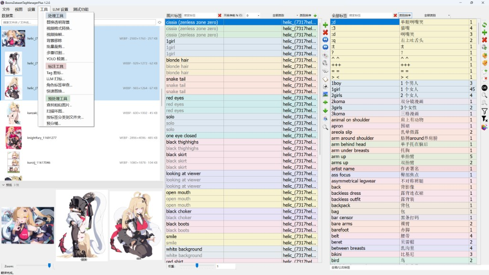
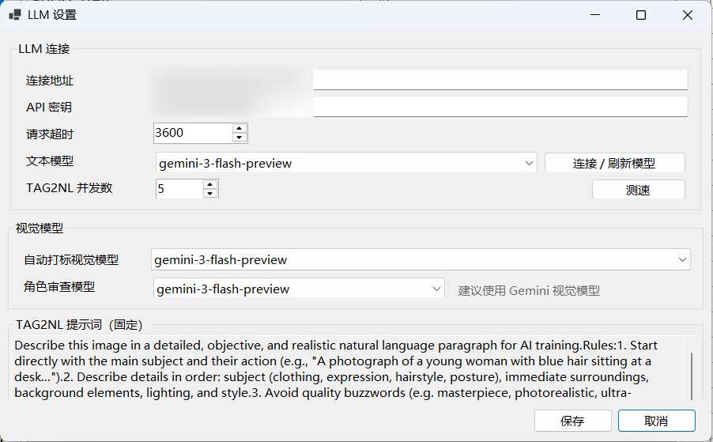
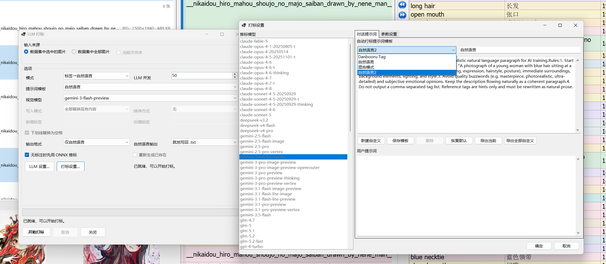
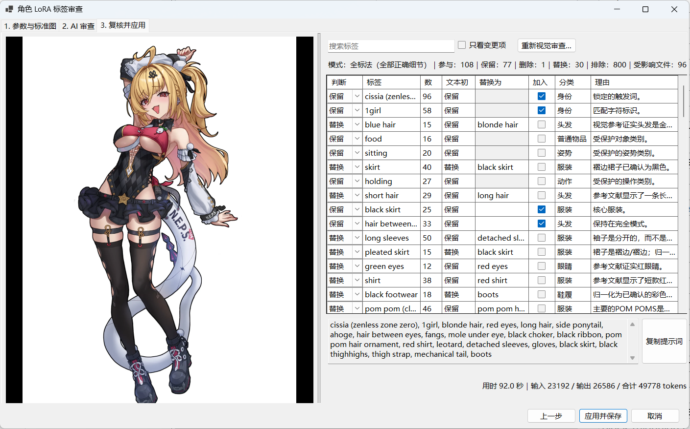
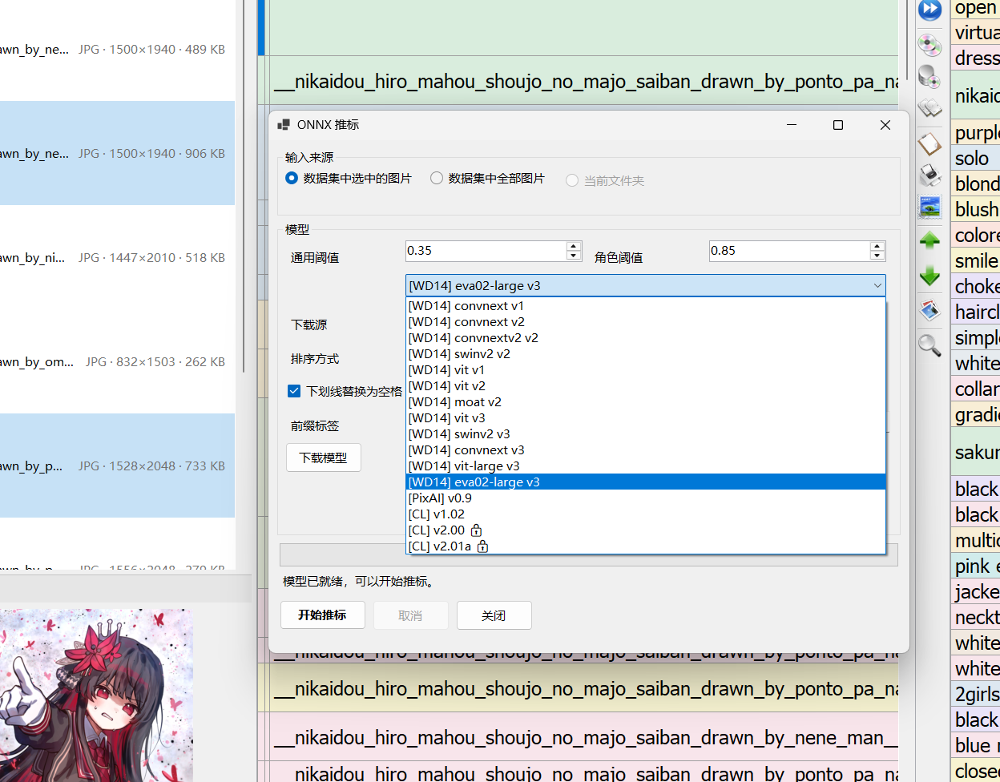
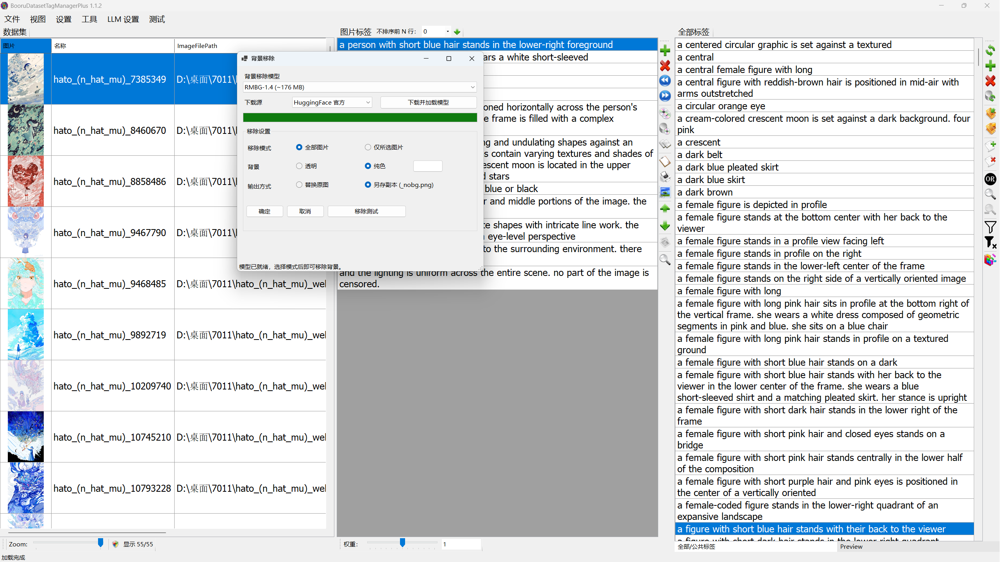
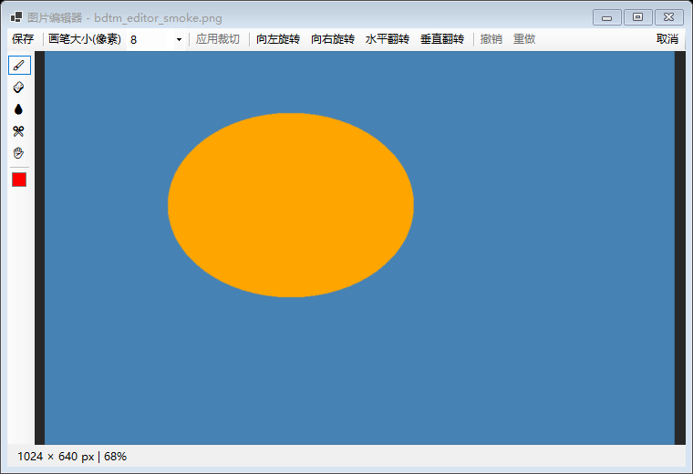
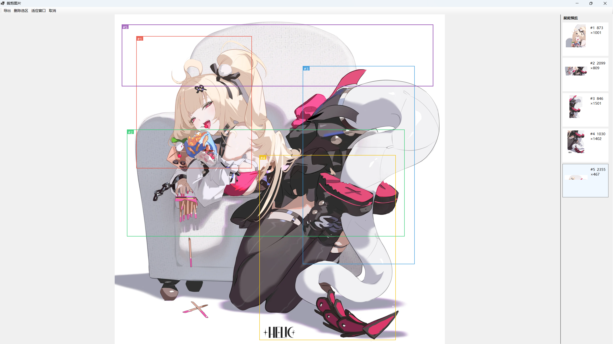
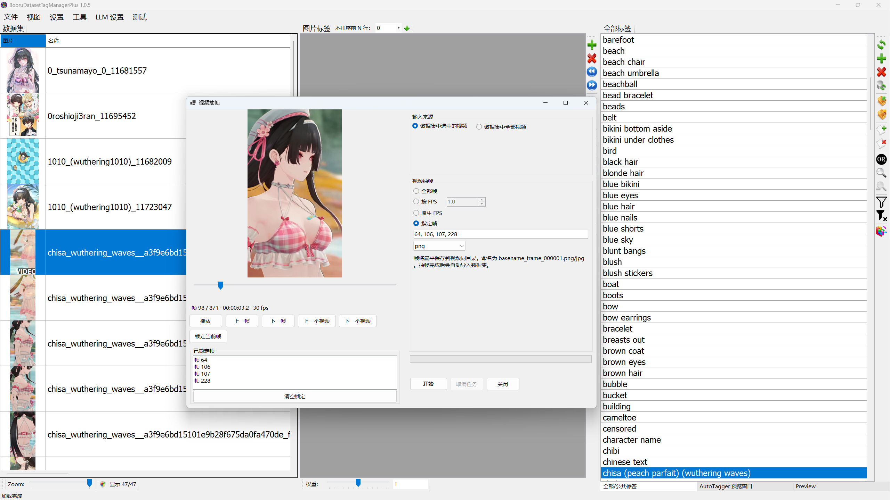
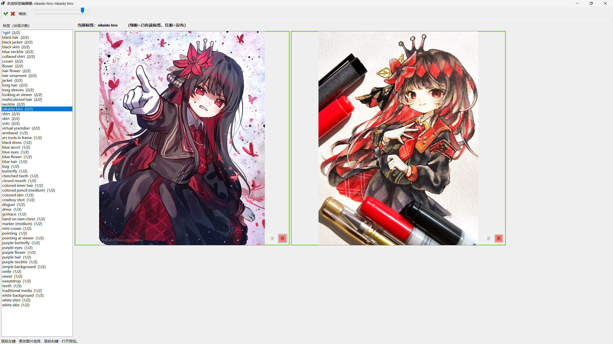

# BooruDatasetTagManager+ 1.2.3

[English](README_en.md) | [Português do Brasil](docs/pt-BR/README_pt_BR.md)

面向 LoRA / 角色数据集的 Windows 标签管理工具,fork 自 **[starik222/BooruDatasetTagManager](https://github.com/starik222/BooruDatasetTagManager)**:保留原版「加载文件夹 → 编辑同名 `.txt`」核心流程,新增 LLM 打标(标签 / 自然语言)、角色标签审查、本地 ONNX 推标与中文标签工作流。**首次启动默认为简体中文界面**,遵循 [MIT License](LICENSE)。



## 更新日志

- **1.2.3**(当前)— 新增:扫描坏图(工具菜单,审查墙绿留红删)、替换透明背景支持按当前文件夹 / 全部图片批量(文件夹右键菜单)。修复:替换透明背景对 WebP 报内存溢出(改走 ImageSharp 解码 + 按扩展名编码)、标签筛选「点 NOT 得 OR」(下拉明选 AND/OR/NOT/XOR)、换标签立刻重筛、再点当前模式取消筛选。安全/I/O 加固:DPAPI 加密失败不再明文落盘密钥、LLM 图像 GDI 泄漏、文件夹重命名路径穿越、模型下载竞态、更新包文件名消毒、审查删除门控改本地分类、Caption/ffmpeg/主题原子写等。[发布说明](docs/RELEASE_NOTES_v1.2.3.md)
- **1.2.2** — 新增:相似图片筛选(重复图按组清理)、角色标签审查多角色模式(最多 4 人)、标签面板类别筛选、数据集平铺视图、错误标签修复、全套命令行 CLI、重新导入当前数据集(F5)。修复:「跳过已有标签列表」不再静默丢结果白扣费(P0)、Ctrl+Z 撤销连环崩溃、未加载数据集时的空引用崩溃、换文件夹残留旧标签等。[发布说明](docs/RELEASE_NOTES_v1.2.2.md)
- **1.2.1** — 全库审计修复第二批:内存与数据安全加固、首载性能、无障碍与 i18n 补全;移除 legacy Python 后端(旧配置自动迁移);数据集浏览器支持根目录单独筛选与多文件夹并集;双角色审查断点续跑;新增可选调试模式;修复悬浮预览遮挡确认框、标签列表失步、高 DPI 提示截断等问题。[发布说明](docs/RELEASE_NOTES_v1.2.1.md)
- **1.2.0** — 数据集面板整体重构:文件夹分组浏览器 + 内嵌多图预览;标签语义着色与类别排序;Danbooru 角色名单匹配(着色 + 译名);全库审计后的发布与数据安全加固。[发布说明](docs/RELEASE_NOTES_v1.2.0.md)
- **1.1.3** — 文件 I/O 与数据安全专项加固(修复内部审计确认的 8 项风险:保存失败不丢编辑、删除事务化、并发写盘安全等);新增图片编辑器、CL 系列 ONNX 模型、标签中文字典搜索与全部标签双击快速操作。[发布说明](docs/RELEASE_NOTES_v1.1.3.md)
- **1.1.2** — 统一 LLM 打标窗口(标签 / 自然语言两种模式);背景移除本地化(RMBG-1.4);崩溃兜底、原子写盘、密钥加密等稳固与安全加固。[发布说明](docs/RELEASE_NOTES_v1.1.2.md)
- **1.1.1** — 角色标签审查「应用并保存」提速;统一「裁剪图片」对话框。[发布说明](docs/RELEASE_NOTES_v1.1.1.md)
- **1.1** — WD14 全系列、按模型阈值、PixAI 修复。[发布说明](docs/RELEASE_NOTES_v1.1.md)
- **1.0.5** — 统一 ONNX 推标、视频工具。[发布说明](docs/RELEASE_NOTES_v1.0.5.md)

## 快速开始

从 [Releases](https://github.com/storyAura/BooruDatasetTagManagerPlus/releases) 下载 `BooruDatasetTagManagerPlus-*-win-x64.zip`,解压后运行 `BooruDatasetTagManagerPlus.exe`(自包含,无需安装 .NET)。

1. **文件 → 加载文件夹**;「加载文件夹(自定义选项)…」还可以关闭预览图(大数据集更快)或从图片元数据读取初始标签(适合刚出图、还没写 `.txt` 的数据集);「重新导入当前数据集」(F5)随时从磁盘刷新当前目录
2. 直接编辑标签:「全部标签」与「图片标签」搜索框支持中文字典(输入「头发」即可定位 long hair、black hair 等);双击「全部标签」行可执行快速操作(默认打开「全部替换」,可在设置更换);遇到生词可开 Danbooru Wiki
3. 使用 LLM 功能前,先在 **LLM 设置** 配置 OpenAI 兼容端点与模型
4. 按需运行 **工具 → LLM 打标 / ONNX 推标 / 背景移除 / 替换透明背景 / 视频工具 / 查找相似图片 / 扫描坏图**,或 **测试 → 打开角色标签审查**（角色标签审查与错误标签修复都在这里）
5. 自动化脚本可直接用同一个 exe 的命令行：`BooruDatasetTagManagerPlus.exe help` 列出全部命令（统计 / 批量改标 / 导出 / fix-tags 修复 / onnx-tag 推标 / audit 审查）

### 从源码构建

```powershell
dotnet build BooruDatasetTagManager.sln -c Debug -f net8.0-windows
dotnet test BooruDatasetTagManager.Tests\BooruDatasetTagManager.Tests.csproj
dotnet publish BooruDatasetTagManager\BooruDatasetTagManager.csproj -c Release -f net8.0-windows -r win-x64 --self-contained true -o dist
```

- `test_start.bat` — 启动 Release(或 Debug)
- `quick_build.bat` — 本地快速打包至 `dist/`(首次构建自动下载 FFmpeg)

运行后程序目录会生成 **Models/**(下载的 ONNX 模型)、**Cache/**(缓存)、**settings.json**(API 与偏好设置)。均为本地自动生成数据,可随时删除——设置恢复默认,模型可在应用内重新下载。

## 功能一览

| 模块 | 说明 |
| --- | --- |
| **数据集浏览** | 文件夹分组浏览器(搜索、折叠、重命名 / 批量重命名、右键快捷推标);平铺视图(忽略文件夹分组一列到底);内嵌预览(多选并排);行内显示格式·像素·大小 |
| **标签语义** | 18 类浅色分类着色、类别排序与类别筛选下拉;内置 Danbooru 角色名单(精确识别 + 「译名 (作品)」翻译 + 父子关系) |
| **LLM 打标** | 标签 / 标签→自然语言两种模式;OpenAI 兼容端点;提示词模板;LLM 并发 1–100 |
| **角色标签审查** | 触发词 + 标准图 + 全库标签清单;AI 两阶段审查;单人 / 多角色(最多 4 人);事务化写回 |
| **ONNX 推标** | WD14 全系列 + PixAI + CL 系列本地推标;各模型阈值独立记忆;HuggingFace 下载 |
| **背景移除** | 内置 RMBG-1.4 ONNX 本地抠图,无需外部服务;透明或纯色背景 |
| **替换透明背景** | 透明底换纯色 / 随机色 / 随机取自颜色列表;运行前先扫描出真正带透明像素的 PNG / WebP,其余跳过;工具菜单处理选中图片,文件夹右键可按该文件夹或全部图片批量;WebP 等格式走 ImageSharp 读写 |
| **图片编辑器** | 画笔 / 橡皮擦 / 吸管 / 裁切 / 旋转翻转,PS 式快捷键;另有独立多重裁剪对话框 |
| **相似图片筛选** | czkawka 式感知哈希找重(4 档相似度);分组审查绿留红删;每组保留一张;事务化删除 |
| **扫描坏图** | 解码失败 / 空文件 / 缺失文件审查墙;绿留红删;事务化删除 |
| **错误标签修复** | 人数标签冲突 / 多人 solo / 角色父子重复一键清理;子级信任阈值(默认 30);预览确认、可撤销 |
| **视频处理** | 格式转换;全部帧 / 按 FPS / 指定帧抽帧;内置 FFmpeg |
| **标签编辑** | 中文字典搜索、全部标签双击快速操作、多选校对(Shift+T)、按标签筛选数据集(AND / OR / 反选 NOT / XOR 下拉明选)、Danbooru Wiki |
| **命令行 CLI** | 同一 exe 无窗口运行:统计 / 批量改标 / 导出 / fix-tags / ONNX 推标 / LLM 审查,面向自动化 |

## 功能详解

### 数据集浏览与预览

数据集面板是一个统一浏览器:顶部搜索框同时过滤文件夹与文件名;kohya 重复文件夹显示为可折叠分组(多文件夹默认全部折叠,搜索框右侧有全部展开 / 全部折叠与平铺视图按钮——平铺开启时忽略文件夹分组、把当前范围与筛选结果摊平为一列,状态记忆),点击文件夹名即可把数据集范围限定到该文件夹(全部标签计数、批量操作与审查向导同步跟随);图片行显示缩略图、文件名与「格式 · 像素 · 大小」,选择操作与文件管理器一致(Ctrl / Shift / Ctrl+A / 方向键 / 右键菜单 / Delete)。

- **文件夹右键**:重命名文件夹(磁盘与内存同步改名,未保存的编辑不丢失);批量重命名图片(前缀 + 数字 / 字母 / 保留原名 + 后缀,实时预览,`.txt` 同步改名);ONNX / LLM 打标此文件夹
- **内嵌预览**:数据集底部可折叠预览面板(视图 → 显示预览,状态记忆);多选时并排显示前 4 张,双击任一格在独立窗口打开;独立预览窗支持光标缩放、拖拽平移、双击适应 ↔ 100%、Ctrl+0 / Ctrl+1
- **标签着色与类别排序**:两个标签面板按 18 类语义浅色着色(角色 / 作品 / 发型 / 眼睛 / 服装…);图片标签工具栏的「类别排序」是记忆开关:勾选后每张选中图自动按分类分组排序(遵守「不排序前 N 行」),状态持久保存;全部标签面板的类别排序默认关闭,可在其工具栏勾选;两个面板的工具栏还各有一个**类别筛选**下拉框:选中某一大类(头发 / 服装…)即只显示该类标签,与搜索、次数过滤叠加,选「全部类别」恢复
- **角色名单**:内置约 33 万条 Danbooru 角色标签(`Data/danbooru_character_tags.csv`,含约 2.6 万条真实父子关系),角色标签精确识别着色,翻译显示为「译名 (作品)」;可在 设置 → 翻译 关闭

### LLM 打标

入口:**工具 → LLM 打标…**、数据集右键,或标签工具栏「自动生成标签」。使用前先在 **LLM 设置** 配置 OpenAI 兼容端点、文本 / 视觉模型与全局 LLM 并发(默认 5,范围 1–100)。





- **标签模式**:图片 → 标签,按写入模式(全部替换 / 追加 / 跳过已有)直接写回数据集,支持排序、前后缀与下划线后处理;提示词模板内置 4 套(Danbooru Tag / 自然语言 / 混合模式 / 自然语言2),可自定义并导出 JSON(不含凭据)
- **标签→自然语言模式**(原 TAG2NL):标签 + 图片 → 自然语言描述;输出格式可选 **标签+自然语言 / 仅自然语言**;默认另存副本到 `数据集目录_captioned/`(源 `.txt` 只读、可跳过已有),也可就地写回原图 `.txt`
- **无标注先 ONNX**:勾选后,对没有标签的图片先用本地 ONNX 推标,再交给 LLM 生成描述——标签→自然语言的自动流水线

### 角色标签审查

入口:**测试 → 打开角色标签审查…**。设定锁定触发词(强制保留)、标签方法(**少标法**只留核心特征 / **全标法**保留全部正确细节)、最小出现次数与标准图后,AI 先文本初筛、再视觉复核(流程不可回退,改参数请取消后重开);最后逐条复核(保留 / 删除 / 替换 / 不确定)、预览最终角色提示词,**应用并保存**为事务写盘、失败自动回滚。

支持**多角色**数据集(最多 4 人):主体模式选择 双人 或 多角色 后,为每个角色设定触发词、标准图与性别(留空的角色行自动跳过,因此三人数据集也适用);图片按触发词、再按文件夹自动归属,多人同图自动补齐 `2girls`、`multiple girls` 等主体数标签,AI 审查、逐条复核与应用均逐角色进行,某个角色失败时可只重试该角色(已完成角色的结果保留)。



### ONNX 推标

入口:**工具 → ONNX 推标…**,或数据集右键 **ONNX 重新推标**(自动开始);文件夹右键 **ONNX 打标此文件夹…** 会预选「当前文件夹」来源,确认设置后再开始。



- 模型:WD14 全系列 12 款 + PixAI 0.9 + CL 系列(cl_tagger v1.02、cl_tagger_v2 v2.00 / v2.01a 🔒);各模型阈值与设置独立保存;HuggingFace 官方或镜像下载
- cl_tagger_v2 为**受限(gated)仓库**,作者许可禁止再分发与捆绑分发——软件不附带模型;下载前弹出许可提示,需自行在 HuggingFace 申请访问并填入 Access Token(DPAPI 加密保存),或手动下载放入 `Models` 目录
- 写入模式(全部替换 / 追加 / 跳过已有)、可选排序、下划线→空格、前后缀标签;批量推标带进度条;「跳过已有标签列表」模式在推理前就跳过已有标签的图片,完成时如实报告写入 / 跳过数量

### 背景移除

入口:**工具 → 背景移除**,或数据集右键 **移除背景**。内置 RMBG-1.4 ONNX 本地抠图,**无需外部服务**;首次使用一键下载模型(约 176 MB,或量化版约 44 MB,官方 / 镜像源)。



- 范围:全部图片或仅所选;背景:**透明**或**纯色**(默认白,带取色器);「移除测试」可先对单张预览
- 输出:**替换原图**或**另存 `_nobg.png` 副本**(选项记忆);完成后自动刷新缩略图或导入副本

### 图片编辑器

入口:数据集右键 **编辑图片**。仿 Photoshop 布局:左侧紧凑工具箱、顶部选项栏、底部状态栏。



- 快捷键与 PS 一致:**B** 画笔、**E** 橡皮擦、**I** 吸管、**C** 裁切、**H** 抓手(或按住**空格**)、`[`/`]` 笔刷大小、**Alt+点击** 临时取色、滚轮以光标为中心缩放、**Ctrl+0** 适应窗口、**Ctrl+1** 100%、**Ctrl+Z / Ctrl+Shift+Z / Ctrl+Y** 撤销重做(整笔一步,最多 15 步)、**Enter** 应用裁切、**Ctrl+S** 保存
- 保存可**覆盖原图**(原子写,失败不损坏原文件)或**另存 `_edit` 副本**(自动克隆同名标签文件并导入数据集);默认方式在 设置 → 界面 选择
- 另有数据集右键 **裁剪图片**:一次画多个选区,导出同目录 `_r1/_r2…` 并自动导入数据集



### 视频处理

**工具 → 视频格式转换… / 视频抽帧…**。mp4 / mkv / avi / webm / mov / flv 互转(可替换原文件);全部帧 / 按 FPS / 原生 FPS / 指定帧号抽帧,带预览与锁定帧流程;结果自动导入数据集。Release 包内置 FFmpeg。



### 多选标签校对

多选图片后按 **Shift+T** 打开可视化编辑器:左侧标签列表(含出现次数、按频次排序)点击切换校对目标;**绿框 = 已有该标签,红框 = 没有**,点击图片上的 是/否 即可增删;跨标签修改一次「保存」统一生效。



### 相似图片筛选

入口:**工具 → 查找相似图片…**。参考 [czkawka](https://github.com/qarmin/czkawka) 的感知哈希方案(dHash + 汉明距离),直接用内存中的缩略图计算,数千张图秒级完成;选中某个文件夹时只扫描该范围,视频自动跳过。

- 相似度四档(极高 / 高 / 中 / 低),结果按组展示;**绿框 = 保留,红框 = 待删除**,左键切换,右键查看原图,悬停显示文件名与大小,滑块调缩略图尺寸
- **每组保留一张(最大文件)** 一键把其余标记为待删除(czkawka 同款默认策略),也可手动逐张调整
- **删除标红图片** 走与主界面相同的事务化删除(图片与标签文件一起暂存-删除,失败自动恢复),完成后自动重新扫描

### 扫描坏图

入口:**工具 → 扫描坏图…**。在当前数据集(含文件夹范围)内逐张尝试解码,找出损坏、空文件或已缺失的图片;视频自动跳过。

- 结果以审查墙展示;**绿框 = 保留,红框 = 待删除**(默认全部标红),左键切换,悬停显示文件名与损坏原因,滑块调缩略图尺寸
- **删除标红图片** 走与主界面相同的事务化删除,完成后自动重新扫描

### 替换透明背景

入口:**工具 → 替换透明背景**(选中图片);数据集浏览器文件夹组头右键 → **替换透明背景(当前文件夹)** / **替换透明背景(全部图片)**。把透明底填成指定纯色、随机色,或从自建颜色列表里随机取色。

- **先扫描再替换**:先按扩展名筛出能带 alpha 的格式(PNG / WebP / GIF),再逐张解码确认真的有透明像素;JPG 等无 alpha 格式与整张不透明的 PNG / WebP 一律跳过,不会被重新编码
- 解码走 ImageSharp(`ImageLoader`),编码按目标扩展名走 `ImageEditorSaveService`,**WebP / TIFF / GIF 都能正常读写**(旧版对 WebP 会报「Out of Memory」)
- 文件夹右键处理右键点中的文件夹(多选时为这几个文件夹的并集),「全部图片」处理整个数据集;确认框写明「将替换 N 张(已检查 M 张)」,扫描与替换过程状态栏都有进度;视频自动跳过
- 覆盖写入走原子替换,中途失败不会毁掉原图;单张失败只汇总报错,不中断整批

### 错误标签修复

入口:**测试** 菜单窗口(与角色标签审查同一入口)的「错误标签修复」分组。扫描当前数据集(或选中的文件夹范围),把矛盾标签整理成「图片 / 移除 / 保留 / 原因」预览表,确认后一键应用——应用为普通编辑,可逐图撤销,不会自动写盘。

- **人数标签冲突**:`1boy` 与 `2boys` 并存删低留高(同性别保留最大人数);多人图中的 `solo` 一并清除,含义不同的 `solo focus` 永不误伤
- **角色父子 / 变体重复**:同一角色家族的多个标签同图出现时按数据集出现量投票保留胜者;家族判定用角色表内置的真实父子关系(`racing miku` ↔ `hatsune miku` 这类改名变体也能配对,同名不同人不会误合并)
- **子级信任阈值**(按钮旁可调,默认 30,0 关闭):子级变体在数据集中出现次数低于阈值时不被信任,自动并入父级标签——零散小变体合流到主标签,训练特征更集中

### 命令行(CLI)

`BooruDatasetTagManagerPlus.exe` 本身就是命令行工具:第一个参数是已知命令时无窗口运行(输出可重定向,退出码 0/1/2 = 成功/运行错误/用法错误),否则照常打开界面。`help` 查看全部用法:

- **数据集操作**:`stats` 统计;`list-images` / `list-tags` / `classify-tags` 查询(按标签、语义类别、次数过滤);`add-tags` / `remove-tags` / `replace-tag` 批量改标(条件筛选、`--dry-run` 预演);`export` 导出 JSON
- **`fix-tags`**:错误标签修复的命令行版,`--child-threshold` 调信任阈值、`--catalog` 指定自定义关系表
- **`onnx-models` / `onnx-tag`**:本地 ONNX 推标——列出 / 自动下载模型(受限模型支持 `--hf-token`),阈值与写入模式与界面同语义,「跳过已有」在推理前过滤
- **`audit`**:LLM 角色标签审查——沿用界面保存的 API 配置与审查提示词,两阶段审查后事务化写回,`--report` 输出 JSON 报告,`--dry-run` 只看决策
- 所有写盘走原子替换;标签格式(逗号分隔、小写去重)与界面一致,可与手工编辑混用

### 数据与隐私

- **LLM 打标与角色标签审查会把图片发送到你配置的端点**;ONNX 推标、背景移除与视频处理全部在本机完成
- 设置(含 DPAPI 加密的 API 密钥)保存在本地 `settings.json`;标签保存为原子写,批量图片操作先写临时文件、成功后才替换;删除经暂存目录两段执行,中途失败会自动恢复。注意:视频转换勾选"替换原文件"时,转换成功后会删除源视频
- 「设置 → 常规」可启用**调试模式**(默认关闭):开启后菜单栏出现 Debug 菜单,运行信息与异常会记录到程序目录的 `debug.log`(菜单内可一键打开),便于反馈问题时附上日志

## 致谢与许可

- **[starik222](https://github.com/starik222)** — [BooruDatasetTagManager](https://github.com/starik222/BooruDatasetTagManager) 原作者,本项目在其基础上开发
- **[FFmpeg](https://ffmpeg.org/)** — 视频处理(GPL 组件,随 Release 打包)
- 本项目遵循 [MIT License](LICENSE);分发修改版构建时请保留原作者版权声明
