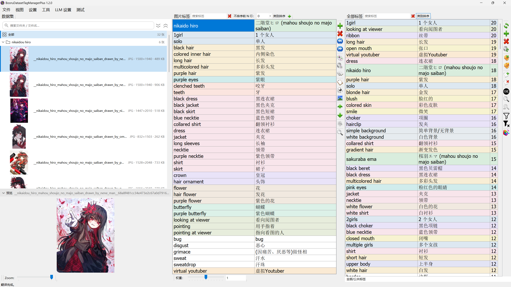
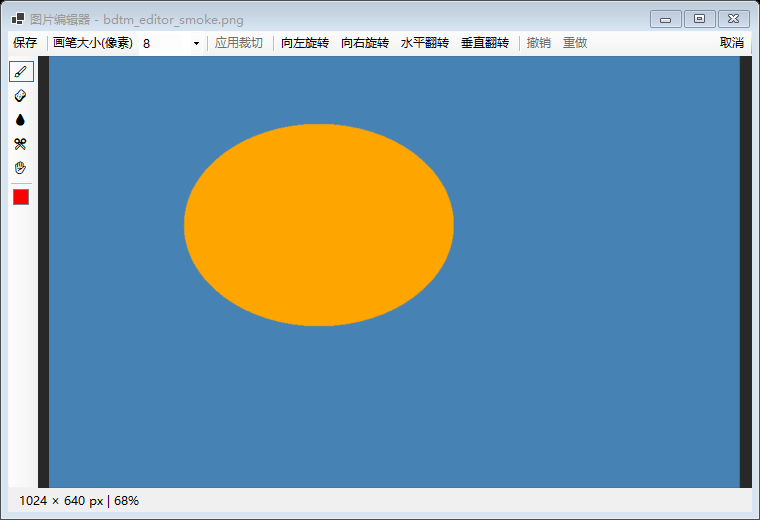
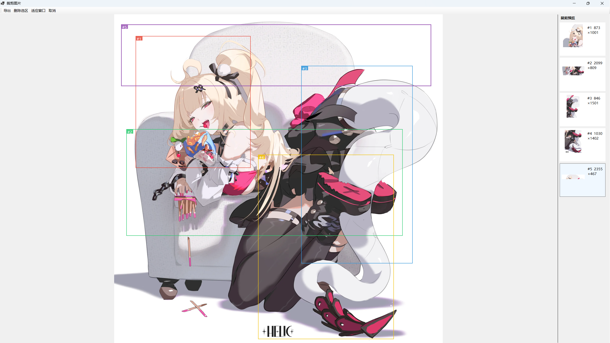

# BooruDatasetTagManager+ 1.2.0

[简体中文](README.md) | [Português do Brasil](docs/pt-BR/README_pt_BR.md)

Windows tool for LoRA and character dataset tagging, forked from **[starik222/BooruDatasetTagManager](https://github.com/starik222/BooruDatasetTagManager)**. It keeps the original "load a folder → edit the matching `.txt`" workflow and adds LLM tagging (Tags / Natural-language modes), character tag audit, local ONNX tagging, and a Chinese tag workflow. **Default UI language is Simplified Chinese (zh-CN).** Licensed under the [MIT License](LICENSE).



## Changelog

- **1.2.0** (current) — dataset panel rebuilt as a unified folder-group browser (search, collapse, batch rename, per-folder quick tagging) with an embedded multi-image preview; semantic tag colors and category sort; danbooru character-catalog matching (colors + translated names); many translation, wiki-popup and audit-wizard fixes; audit-driven release and data-safety hardening (rename rollback, HF token confined to huggingface.co, clean-room packaging, LLM save gate, video-replace overwrite guard, fault-tolerant settings startup). [Release notes](docs/RELEASE_NOTES_v1.2.0.md)
- **1.1.3** — file-I/O and data-safety hardening (fixes the 8 risks confirmed by an internal audit: failed saves keep edits, transactional deletion, safe concurrent writes, …); adds the image editor, CL-family ONNX models, Chinese-dictionary tag search, and the All Tags double-click quick action. [Release notes](docs/RELEASE_NOTES_v1.1.3.md)
- **1.1.2** — unified LLM tagging window (Tags / Natural-language modes); in-process background removal (RMBG-1.4); crash backstop, atomic writes, encrypted keys, and other robustness/security hardening. [Release notes](docs/RELEASE_NOTES_v1.1.2.md)
- **1.1.1** — faster character-tag-audit save; unified Crop image dialog. [Release notes](docs/RELEASE_NOTES_v1.1.1.md)
- **1.1** — full WD14 catalog, per-model thresholds, PixAI fix. [Release notes](docs/RELEASE_NOTES_v1.1.md)
- **1.0.5** — unified ONNX tagger, video tools. [Release notes](docs/RELEASE_NOTES_v1.0.5.md)

## Getting started

Download `BooruDatasetTagManagerPlus-*-win-x64.zip` from [Releases](https://github.com/storyAura/BooruDatasetTagManagerPlus/releases), extract, and run `BooruDatasetTagManagerPlus.exe` (self-contained; no separate .NET install required).

1. **File → Load Folder**; *Load Folder (Custom Options)…* can additionally skip thumbnails (faster for large datasets) or read initial tags from image metadata (handy for fresh generations without `.txt` files yet)
2. Edit tags directly: the All Tags and Image Tags search boxes understand the Chinese dictionary (typing 头发 finds long hair, black hair, …); double-clicking an All Tags row runs a quick action (opens "Replace all" by default, configurable in Settings); open the Danbooru Wiki for unfamiliar tags
3. Before using any LLM feature, configure your OpenAI-compatible endpoint and models in **LLM Settings**
4. Run **Tools → LLM tagging / ONNX tagger / Remove background / video tools**, or **Test → Open character tag audit**, as needed

### Build from source

```powershell
dotnet build BooruDatasetTagManager.sln -c Debug -f net8.0-windows
dotnet test BooruDatasetTagManager.Tests\BooruDatasetTagManager.Tests.csproj
dotnet publish BooruDatasetTagManager\BooruDatasetTagManager.csproj -c Release -f net8.0-windows -r win-x64 --self-contained true -o dist
```

- `test_start.bat` — launch Release (or Debug)
- `quick_build.bat` — quick local build to `dist/` (downloads FFmpeg on first build)

Running locally creates **Models/** (downloaded ONNX weights), **Cache/**, and **settings.json** (API keys and preferences) beside the executable. All are locally generated and safe to delete — settings reset to defaults, and models can be re-downloaded from inside the app.

## Features

| Module | Description |
| --- | --- |
| **Dataset browser** | Folder-group browser (search, collapse, rename / batch rename, per-folder quick tagging); embedded preview (multi-select tiles); inline format·pixels·size |
| **Tag semantics** | 18-category light tints and category sort; built-in danbooru character catalog (exact matching + "name (franchise)" translations) |
| **LLM tagging** | Tags / Tags→Natural-language modes; OpenAI-compatible endpoint; prompt templates; LLM concurrency 1–100 |
| **Character tag audit** | Trigger word + reference image + dataset inventory; two-stage AI review; single / dual character; transactional save |
| **ONNX tagger** | Local WD14 catalog + PixAI + CL family; per-model threshold memory; HuggingFace download |
| **Background removal** | Built-in RMBG-1.4 ONNX, fully local — no external service; transparent or solid background |
| **Image editor** | Brush / eraser / eyedropper / crop / rotate & flip with Photoshop-style shortcuts; separate multi-region crop dialog |
| **Video tools** | Format conversion; all frames / by FPS / specific frames extraction; bundled FFmpeg |
| **Tag editing** | Chinese-dictionary search, All Tags double-click quick action, multi-select review (Shift+T), Danbooru Wiki |

## Feature guide

### Dataset browser & preview

The dataset panel is one unified browser: the search box filters folders and file names together; kohya repeat folders render as collapsible groups (multi-folder datasets open fully collapsed; expand-all / collapse-all buttons sit next to the search box), and clicking a folder header scopes the dataset to it (All Tags counts, bulk operations and the audit wizard follow); image rows show the thumbnail, the name and `format · pixels · size`, with file-manager-style selection (Ctrl / Shift / Ctrl+A / arrows / context menu / Delete).

- **Folder right-click**: rename the folder (disk + in-memory remap, unsaved edits survive); batch rename images (prefix + numeric / letters / original name + suffix, live preview, `.txt` follows); tag the folder with ONNX / LLM
- **Embedded preview**: collapsible panel under the browser (View → Show preview, state persisted); multi-select tiles the first four images, double-click a cell to open it in the floating viewer; the floating window supports cursor-anchored zoom, drag pan, double-click fit ↔ 100 %, Ctrl+0 / Ctrl+1
- **Tag colors & category sort**: both tag panes tint rows across 18 semantic categories (character / copyright / hair / eyes / clothing …); the image-tags toolbar's *Category sort* groups by category while honoring "don't sort first N rows"; the All Tags category sort is opt-in (off by default)
- **Character catalog**: ~330 k danbooru character tags ship in `Data/danbooru_character_tags.csv` for exact character coloring and "name (franchise)" translations; can be disabled in Settings → Translation

### LLM tagging

Entry: **Tools → LLM tagging…**, the dataset context menu, or the tag-toolbar "Auto generate tags" button. First configure the OpenAI-compatible endpoint, text/vision models, and the global LLM concurrency (default 5, range 1–100) in **LLM Settings**.


- **Tags mode** — image → tags, written back to the dataset per the write mode (replace / append / skip existing), with sort, prefix/suffix, and underscore post-processing; four built-in prompt templates (Danbooru Tag / Natural language / Hybrid / Natural language 2), custom templates export as JSON without credentials
- **Tags → Natural-language mode** (formerly TAG2NL) — tags + image → a natural-language caption; output format **Tags+NL / NL only**; saves a copy to `dataset_captioned/` by default (source `.txt` read-only, existing skippable) or writes in place into the image's own `.txt`
- **ONNX first if untagged** — images with no tags are first tagged by the local ONNX tagger, then handed to the LLM — an automatic tags → natural-language pipeline

### Character tag audit

Entry: **Test → Open character tag audit…**. Set the locked trigger word (always kept), the tagging style (**sparse** keeps core features / **full** keeps every correct detail), a minimum occurrence threshold, and a reference image; the AI then runs a text screening followed by a visual review (no step back — cancel and reopen to change parameters); finally review each decision (keep / delete / replace / unsure), preview the resulting character prompt, and **Apply & Save** writes transactionally with rollback on failure.

**Dual-character datasets** are supported: give characters A / B their own trigger word, reference images and gender; images are attributed by trigger word, then by folder, shared images automatically receive subject-count tags (`2girls` and the like), and the AI review, per-tag review and apply all run character by character.


### ONNX tagger

Entry: **Tools → ONNX tagger…**, or right-click **Retag with ONNX** on selected images (starts automatically); the folder right-click **Tag folder with ONNX…** preselects the *Current folder* source and starts after you confirm the settings.


- Models: full WD14 catalog (12 models) + PixAI 0.9 + CL family (cl_tagger v1.02, cl_tagger_v2 v2.00 / v2.01a 🔒); thresholds and settings remembered per model; download from HuggingFace official or mirror
- cl_tagger_v2 is a **gated repo** whose author license forbids redistribution and bundling — the app does not ship it; a license notice shows before download, and you must request access on HuggingFace and enter your own access token (stored DPAPI-encrypted), or place manually downloaded files into the `Models` folder
- Write mode (replace / append / skip existing), optional sort, underscore→space, prefix/suffix tags; progress bar for batch runs

### Background removal

Entry: **Tools → Remove background**, or the dataset context menu. Built-in RMBG-1.4 ONNX runs fully locally — **no external service**; one-click model download on first use (~176 MB, or ~44 MB quantized; official / mirror source).


- Scope: all images or selected only; background: **transparent** or **solid color** (white by default, with a color picker); "Removing test" previews a single image first
- Output: **overwrite the original** or **save a `_nobg.png` copy** (choices remembered); thumbnails refresh or copies import automatically afterwards

### Image editor

Entry: dataset context menu → **Edit image**. Photoshop-style layout: compact tool box on the left, options bar on top, status bar at the bottom.



- Photoshop-consistent shortcuts: **B** brush, **E** eraser, **I** eyedropper, **C** crop, **H** hand (or hold **Space**), `[`/`]` brush size, **Alt+click** samples a color, cursor-anchored wheel zoom, **Ctrl+0** fit, **Ctrl+1** 100%, **Ctrl+Z / Ctrl+Shift+Z / Ctrl+Y** undo/redo (one stroke = one step, up to 15), **Enter** apply crop, **Ctrl+S** save
- Save **overwrites the original** (atomic write — a failed save cannot corrupt the file) or writes an **`_edit` copy** (caption file cloned and imported into the dataset); the default action is configurable under Settings → UI
- There is also a dataset context menu **Crop image** dialog: draw multiple regions at once, export `_r1/_r2…` to the source folder, auto-import into the dataset



### Video tools

**Tools → Video format conversion… / Frame extraction…**. Convert between mp4 / mkv / avi / webm / mov / flv (optional replace-original); extract all frames, by FPS, at native FPS, or by specific frame numbers, with preview and a lock-frame workflow; results import into the dataset. FFmpeg is bundled in Release builds.


### Multi-select tag review

Select multiple images and press **Shift+T**: a left tag list (with occurrence counts, sorted by frequency) switches the reviewed tag; **green border = has the tag, red = missing** — click Y/N on a thumbnail to toggle; edits across multiple tags apply in one Save.


### Data & privacy

- **LLM tagging and the character tag audit send images to your configured endpoint**; ONNX tagging, background removal, and video tools run entirely on your machine
- Settings (including DPAPI-encrypted API keys) live in the local `settings.json`; tag saves are atomic, batch tools never destroy originals, and image deletion is transactional with rollback

## Acknowledgments & license

- **[starik222](https://github.com/starik222)** — author of [BooruDatasetTagManager](https://github.com/starik222/BooruDatasetTagManager), which this project builds on
- **[FFmpeg](https://ffmpeg.org/)** — video processing (GPL component bundled in Releases)
- Licensed under the [MIT License](LICENSE); retain upstream copyright notices when redistributing modified builds
