<div align="center">

[English](../../README_en.md) | [简体中文](../../README.md) | **Português do Brasil**

</div>

# BooruDatasetTagManager+ 1.1.2

Ferramenta para Windows de marcação de datasets de LoRA e de personagens. Mantém o fluxo de trabalho original baseado em pastas com arquivos `.txt` e adiciona Marcação LLM (modos Tags / Linguagem natural), auditoria de tags de personagem e ferramentas localizadas em chinês. **O idioma padrão da interface é o chinês simplificado (zh-CN).**

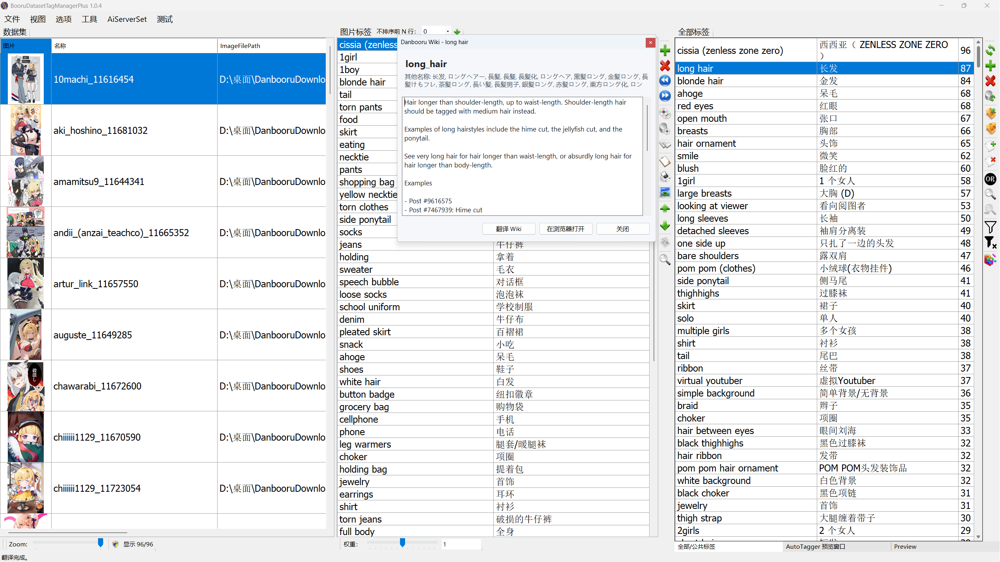

## Linhagem do projeto

Este repositório é um fork de **[starik222/BooruDatasetTagManager](https://github.com/starik222/BooruDatasetTagManager)**. Ele mantém o fluxo original de edição de tags baseado em pastas e adiciona Marcação LLM (Tags / Linguagem natural), auditoria de tags de personagem e ferramentas localizadas em chinês.

Licenciado sob a [Licença MIT](../../LICENSE). Mantenha os avisos de copyright do projeto original (upstream) ao redistribuir builds modificados.

## Funcionalidades

| Módulo | Descrição |
| --- | --- |
| **Configurações LLM** | Endpoint compatível com OpenAI; modelos separados de texto, de visão para auto-tag e de visão para auditoria; concorrência LLM |
| **Marcação LLM** | Janela de execução unificada (no estilo do ONNX): fonte de entrada, **modos Tags / Tags → Linguagem natural**, modelo de prompt, modelo de visão, modo de gravação, concorrência LLM. O modo Tags grava de volta no dataset; o modo Linguagem natural (antigo TAG2NL) oferece conteúdo **Tags + linguagem natural / apenas linguagem natural**, cópia `_captioned` ou gravação no próprio `.txt`, e pode **executar o ONNX primeiro** em imagens sem tags |
| **Auditoria de tags de personagem** | Palavra de ativação + imagem de referência + inventário do dataset; revisão por IA em duas etapas com salvamento transacional |
| **Tagger ONNX** | Interface unificada WD14 + PixAI; download do HuggingFace; limites duplos; modos de gravação; tags de prefixo/sufixo |
| **Ferramentas de vídeo** | Conversão de formato; todos os frames / por FPS / frames específicos; FFmpeg incluído |
| **Remoção de fundo** | RMBG-1.4 ONNX embutido, executa localmente no cliente — **sem serviço externo**; download do modelo com um clique no primeiro uso (~176 MB, ou ~44 MB quantizado); fundo transparente ou de cor sólida (branco por padrão), sobrescreve o original ou salva uma cópia `_nobg.png` |
| **Recortar imagem** | Recorte de região única ou de várias regiões; exporta `_r1`/`_r2` para a pasta de origem; importação automática para o dataset |
| **Revisão de tags com seleção múltipla** | Selecione várias imagens e pressione Shift+T para abrir o editor visual; lista de tags à esquerda com contagem de ocorrências; verde = tem a tag, vermelho = não tem; clique para alternar, um único salvamento para todas as tags |

## Novidades da versão 1.1.2

Uma ampla rodada de reforço de segurança, estabilidade e usabilidade, além de uma janela unificada de **Marcação LLM**.

- **Janela unificada de Marcação LLM** — modos Tags / Tags → Linguagem natural (antigo TAG2NL); formato de saída (Tags + linguagem natural / apenas linguagem natural), cópia `_captioned` ou gravação no local, ONNX primeiro em imagens sem tags; modelo de prompt e configurações de marcação incorporados à janela; a "marcação visual por IA" foi renomeada para "Marcação LLM", com uma configuração global de concorrência LLM
- **Remoção de fundo movida para dentro do processo** — RMBG-1.4 ONNX embutido, sem serviço externo; fundo transparente / cor sólida, sobrescrever ou salvar uma cópia `_nobg.png`
- **Robustez e segurança dos dados** — proteção global contra falhas (`crash.log`); salvamento atômico de tags sem perda de dados; as ferramentas em lote nunca destroem os originais; fechar no meio de uma tarefa cancela com segurança; downloads de modelos resistentes a interrupções + verificação de integridade antes do uso
- **Segurança** — chaves de API criptografadas com DPAPI; autenticação e controle de acesso do servidor de IA; `BinaryFormatter` removido
- **Usabilidade** — verificação de atualizações com um clique nas Configurações; revisão de tags com seleção múltipla (Shift+T) com lista de tags no lado esquerdo; tradução priorizando CSV (ativada por padrão)
- Removidos a aba "Prévia do AutoTagger" e o menu TAG2NL independente; 264 testes unitários aprovados

Detalhes completos (Adicionado / Melhorado / Removido / Corrigido): **[notas da versão v1.1.2](../RELEASE_NOTES_v1.1.2.md)**.

## Novidades da versão 1.1.1

Salvamento mais rápido da auditoria de tags de personagem; diálogo unificado de **Recortar imagem** (várias regiões, exportação `_r1/_r2` na mesma pasta, importação automática para o dataset).

Detalhes completos: **[notas da versão v1.1.1](../RELEASE_NOTES_v1.1.1.md)**; versões anteriores: [v1.1](../RELEASE_NOTES_v1.1.md) (catálogo WD14, correção do PixAI) · [v1.0.5](../RELEASE_NOTES_v1.0.5.md) (Tagger ONNX unificado, ferramentas de vídeo)

## Em relação ao upstream

- Marcação automática por LLM com quatro modelos de prompt integrados, além de importação/exportação de modelos personalizados
- Modo "Linguagem natural" da Marcação LLM (antigo TAG2NL) para legendas em lote (concorrência LLM de 1–100)
- Assistente de auditoria de personagem (estilo enxuto vs. completo, canonicalizador local)
- Dados de origem somente leitura; gravações atômicas, suporte a cancelamento, isolamento de erros por arquivo

## Fluxo de trabalho

1. **Arquivo → Carregar Pasta**
2. Edite as tags; abra a **Wiki do Danbooru** quando necessário
3. Configure os modelos em **Configurações LLM**
4. Execute **Ferramentas → Marcação LLM...** (modos Tags / Tags → Linguagem natural) ou **Teste → Abrir auditoria de tags...**

## Configurações LLM

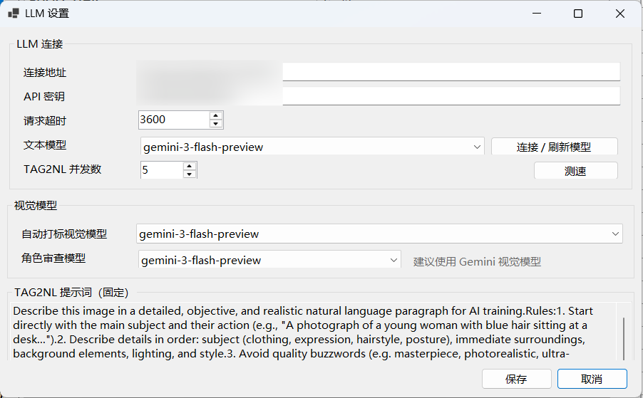

Conexão, modelo de texto, modelos de visão (auto-tag + auditoria de personagem), concorrência LLM (compartilhada pela marcação de tags e pela geração de legendas; padrão 5, de 1 a 100) e o prompt fixo de Linguagem natural (somente leitura, independente dos modelos de auto-tag).

## Modelos de prompt de marcação automática

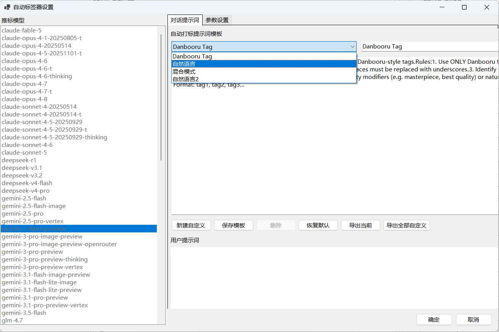

Integrados: Danbooru Tag, Natural Language, Mixed Mode e Natural Language 2. Os modelos personalizados são exportados como JSON, sem credenciais.

## Marcação LLM

**Ferramentas → Marcação LLM...**, clique com o botão direito em uma imagem do dataset → **Marcação LLM**, ou o botão "Gerar tags automaticamente" na barra de ferramentas de tags.

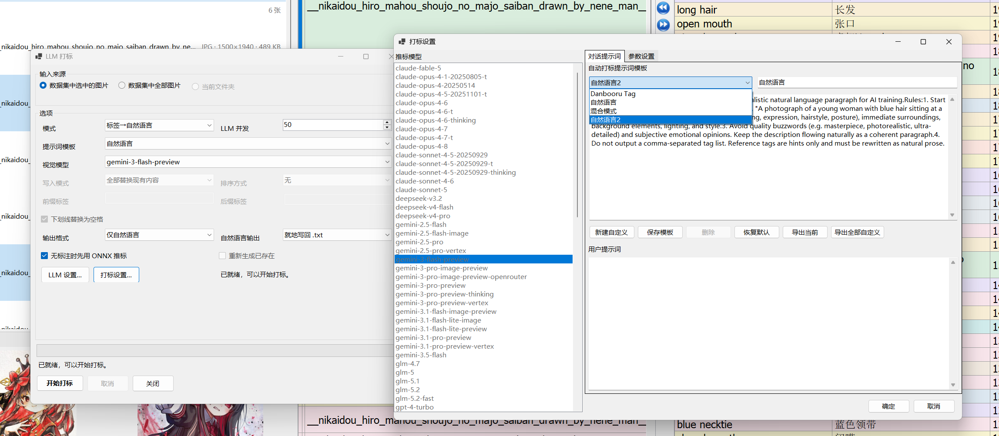

- Comum: fonte de entrada (selecionadas / todas), modelo de visão, uma lista suspensa de **modelo de prompt**, concorrência LLM; **Config. de marcação...** abre o editor completo de prompt/parâmetros e **Configurações LLM...** configura o endpoint e os modelos.
- **Modo Tags** — imagem → tags, gravadas de volta no dataset conforme o modo de gravação (substituir / acrescentar / ignorar existentes), com ordenação, prefixo/sufixo e pós-processamento de sublinhados.
- **Modo Tags → Linguagem natural (antigo TAG2NL)** — tags + imagem → um parágrafo em linguagem natural.
  - **Formato de saída** — **Tags + linguagem natural** (padrão, o formato original do TAG2NL) ou **apenas linguagem natural**.
  - **Saída da legenda** — **Salvar cópia** (padrão) em `dataset_captioned/` (o `.txt` de origem permanece somente leitura; saídas existentes podem ser ignoradas) ou **Gravar no .txt no local**, no próprio `.txt` da imagem (por meio do gerenciador do dataset, de modo que memória e disco permaneçam consistentes).
  - **Marcar com ONNX primeiro se sem tags** — quando habilitado, as imagens sem tags são primeiro marcadas pelo tagger ONNX WD14 local (que oferece baixar o modelo, se necessário) e depois entregues ao LLM — um pipeline automático de tags → linguagem natural.

## Auditoria de tags de personagem LoRA

**Teste → Abrir auditoria de tags...**

1. **Configuração** — palavra de ativação, estilo enxuto/completo, imagem de referência  
   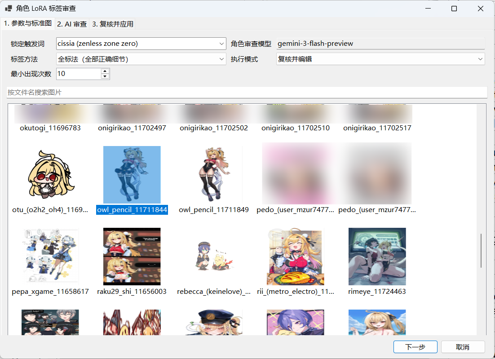
2. **Revisão por IA** — triagem textual e, em seguida, revisão visual (não há como voltar etapas; cancele para recomeçar)
3. **Revisar e aplicar** — edite as decisões, pré-visualize o prompt, salvamento transacional  
   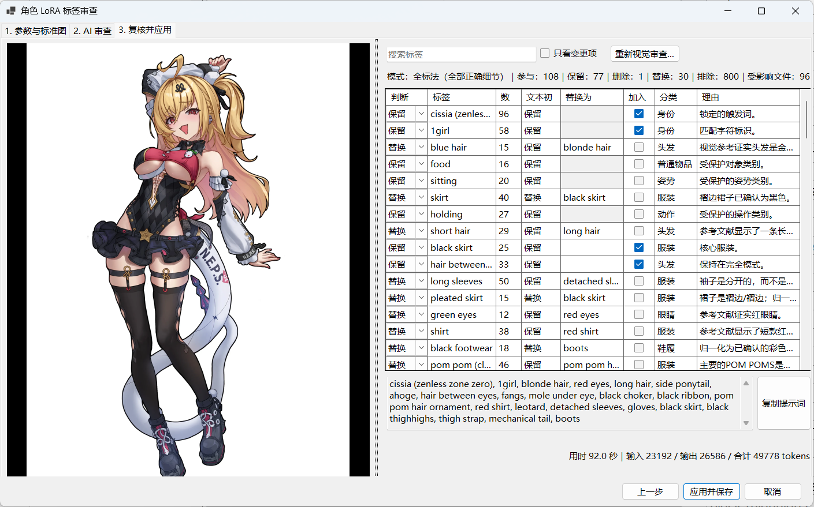

O modo enxuto remove localmente as tags de aparência não essenciais após a revisão visual; o modo completo mantém os detalhes confirmados.

## Tagger ONNX

**Ferramentas → Tagger ONNX...** ou clique com o botão direito em **Retaguear com ONNX** nas imagens selecionadas.

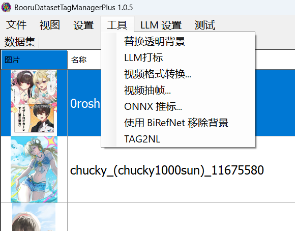

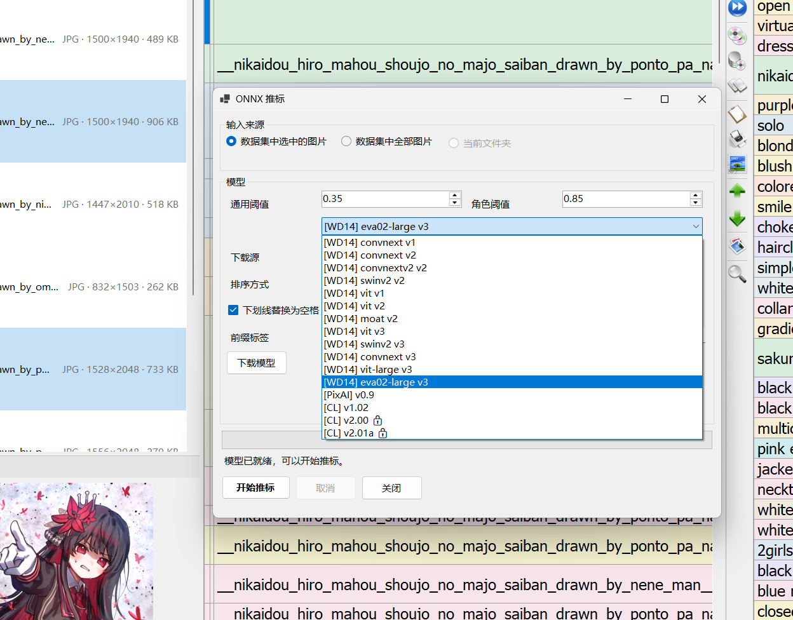

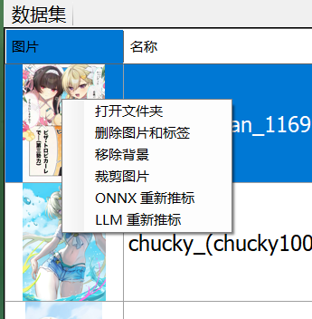

- Seletor de modelo: catálogo WD14 completo (12 modelos) e PixAI 0.9; memorização dos limites por modelo
- Download do HuggingFace oficial ou do espelho HF; as configurações são salvas automaticamente por modelo
- Modo de gravação (substituir / acrescentar / ignorar existentes) e ordenação opcional das tags
- Pós-processamento: substituir sublinhados por espaços (somente na inferência ONNX), tags de prefixo/sufixo
- Barra de progresso para a marcação em lote; retaguear pelo botão direito abre o diálogo e inicia automaticamente

## Ferramentas de vídeo

**Ferramentas → Conversão de vídeo...** / **Extração de frames...**

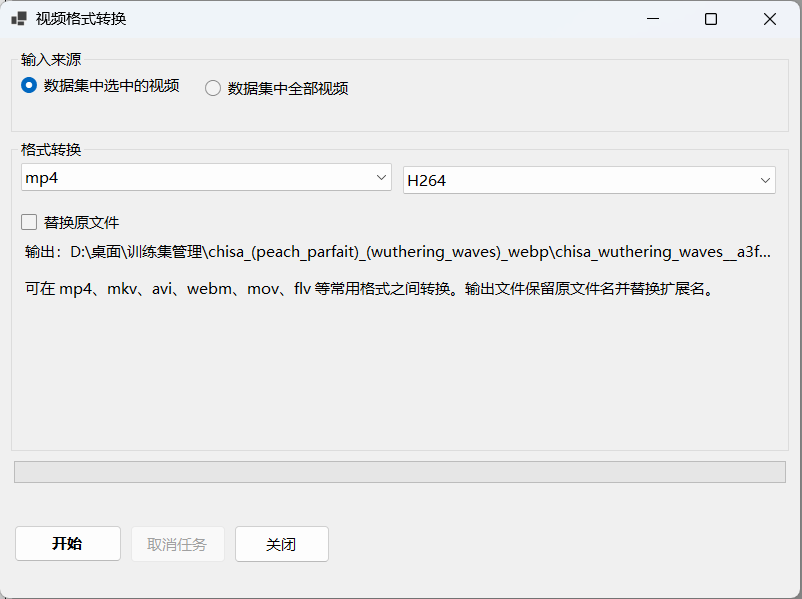

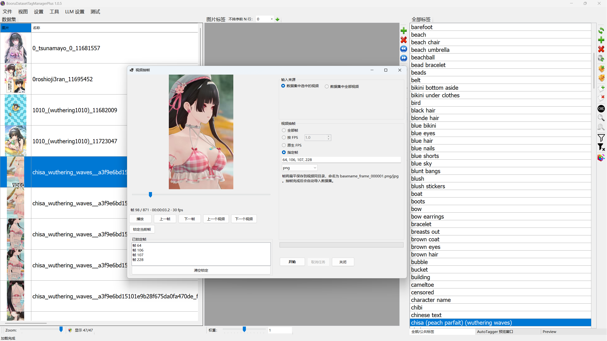

- Converta entre mp4, mkv, avi, webm, mov e flv; opção de substituir o arquivo original
- Extraia todos os frames, por FPS, no FPS nativo ou por números de frame específicos, com pré-visualização e fluxo de bloqueio de frames
- Os frames extraídos são importados para o dataset; o FFmpeg vem incluído nos builds de Release

## Remoção de fundo

**Ferramentas → Remover fundo**, ou clique com o botão direito em uma imagem do dataset → **Remover fundo**.

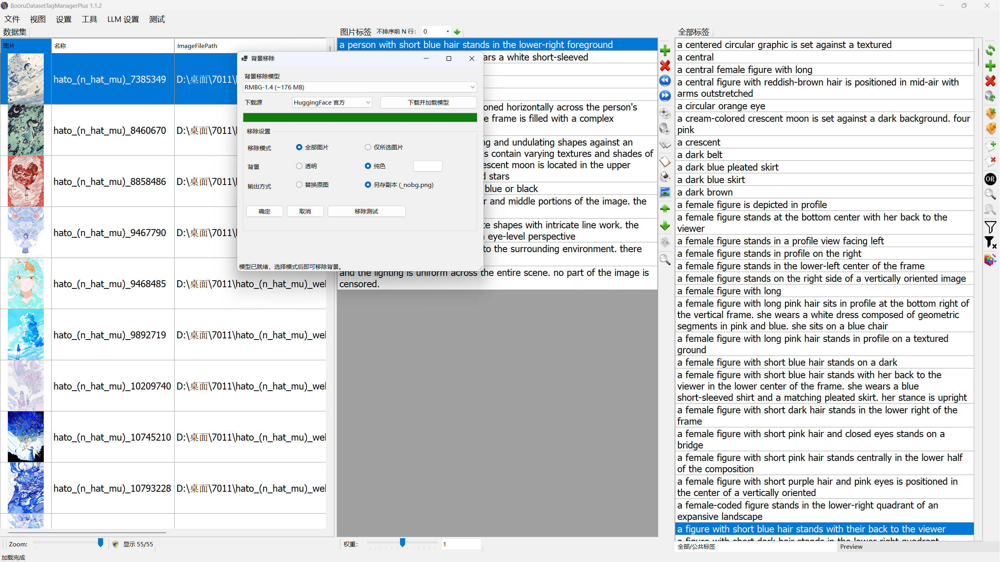

- O RMBG-1.4 ONNX embutido executa localmente no cliente — **sem serviço externo**; um clique em "Baixar e carregar modelo" faz o download no primeiro uso (~176 MB, ou ~44 MB quantizado; fonte oficial / espelho), e um modelo já em cache carrega automaticamente ao abrir a janela
- Escopo: todas as imagens ou apenas as selecionadas; fundo: **Transparente** ou **Cor sólida** (branco por padrão, com seletor de cores)
- Saída: **Substituir original** ou **Salvar cópia (`_nobg.png`)** (ambas as escolhas são lembradas); o botão "Removing test" pré-visualiza primeiro uma única imagem
- Em seguida, as miniaturas da grade e a pré-visualização são atualizadas (modo substituir) ou as cópias são importadas para o dataset (modo salvar cópia)

## Revisão de tags com seleção múltipla

Selecione várias imagens e pressione **Shift+T**.

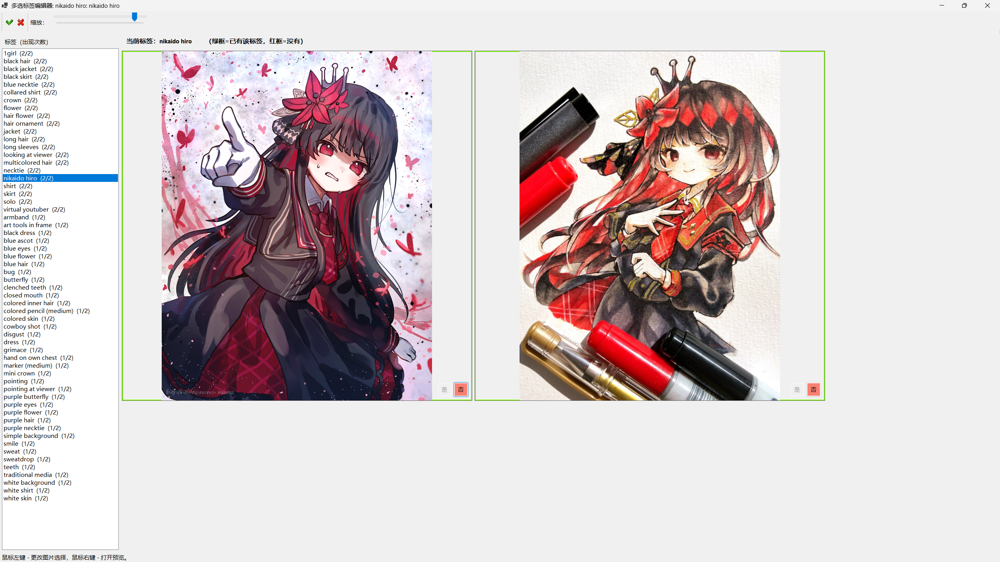

- Lista de tags à esquerda com contagem de ocorrências (ordenada por frequência); clique para trocar a tag em revisão
- **Borda verde = tem a tag, vermelha = não tem**; clique em Y/N em uma miniatura para alternar
- As edições em várias tags são aplicadas em um único salvamento; clique com o botão direito em uma miniatura para abrir a pré-visualização

## Agradecimentos

- **[starik222](https://github.com/starik222)** — autor do [BooruDatasetTagManager](https://github.com/starik222/BooruDatasetTagManager)
- **[FFmpeg](https://ffmpeg.org/)** — processamento de vídeo (componente GPL incluído nos Releases)

## Instalação

**Recomendado:** baixe `BooruDatasetTagManagerPlus-*-win-x64.zip` em [Releases](https://github.com/storyAura/BooruDatasetTagManagerPlus/releases), extraia e execute `BooruDatasetTagManagerPlus.exe` (autocontido; não requer instalação separada do .NET).

Compilar a partir do código-fonte:

```powershell
dotnet build BooruDatasetTagManager.sln -c Debug -f net8.0-windows
dotnet test BooruDatasetTagManager.Tests\BooruDatasetTagManager.Tests.csproj
dotnet publish BooruDatasetTagManager\BooruDatasetTagManager.csproj -c Release -f net8.0-windows -r win-x64 --self-contained true -o dist
```

- `test_start.bat` — inicia a versão Release (ou Debug)
- `quick_build.bat` — build local rápido para `dist/` (baixa o FFmpeg no primeiro build)

A execução local cria **Models/** (pesos ONNX baixados), **Cache/** (por exemplo, miniaturas de vídeo) e **settings.json** (chaves de API e preferências) ao lado do executável. São dados locais gerados automaticamente e podem ser excluídos com segurança — as configurações voltam ao padrão e os modelos podem ser baixados novamente de dentro do aplicativo.

As imagens enviadas para a Marcação LLM (incluindo Tags → Linguagem natural) ou para a auditoria de personagem vão para o endpoint que você configurou; a remoção de fundo e as ferramentas de vídeo executam totalmente no local. As configurações de API ficam no arquivo local `settings.json`.
